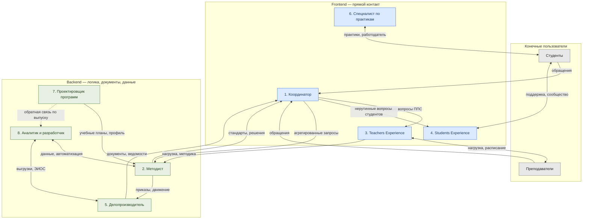
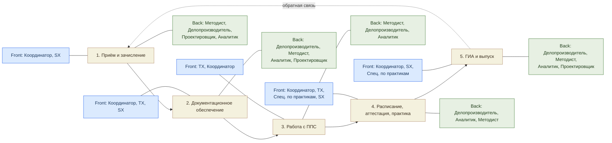

# Графы взаимодействия ролей (ВО, UU)

Диаграммы выполнены в формате **Mermaid** и воспроизводятся без правок в любом
редакторе с его поддержкой (GitHub, Obsidian, Notion, [mermaid.live](https://mermaid.live)).
Скопируйте блок кода целиком.

---

## Граф 1. Структура взаимодействия ролей

Показывает, кто с кем взаимодействует и как устроена передача между планами.
Сплошные стрелки — обращения и запросы, двусторонние — постоянные отношения,
пунктир — обратная связь.

**Как читать.** Координатор — единственный вход для пользователей; от него запросы
расходятся по двум направлениям: на вторую линию Frontend (TX, SX) и на Backend.
Пара Координатор ↔ Методист — главный шов между поверхностью и логикой.
Делопроизводитель и Аналитик образуют сквозной слой, к которому обращаются
большинство ролей.

---

## Граф 2. Процессы и передача между планами

Показывает пять процессов как последовательность от приёма до выпуска и то, какая
сторона ведёт каждый этап. Пунктир замыкает цикл: результаты выпуска возвращаются в
проектирование программ.

**Как читать.** Верхний ряд узлов (Front) и нижний ряд (Back) показывают, какие роли
ведут каждый процесс с каждой стороны. Горизонтальная цепочка — последовательность
процессов; пунктирная стрелка от выпуска к приёму делает цикл замкнутым.

---

## Примечание о воспроизведении

Если редактор не поддерживает тег ` ` в подписях, замените переносы на пробел —
смысл диаграммы не изменится. Цвета заданы через `classDef` и при необходимости
правятся в одной строке для всей группы узлов.
